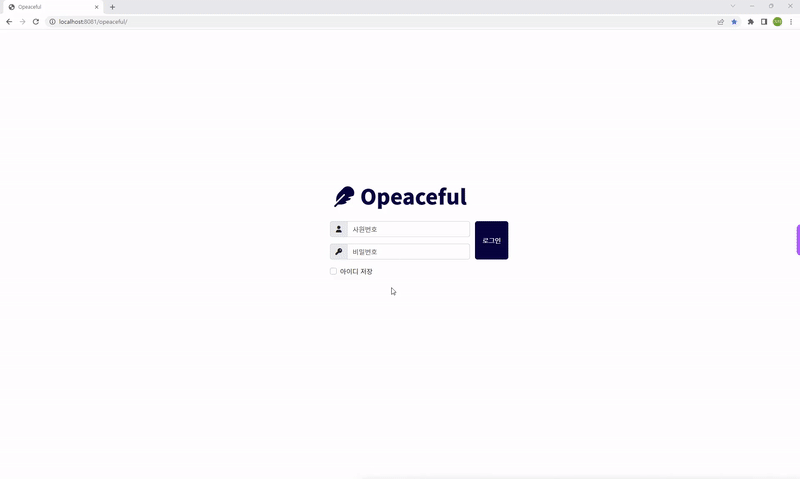
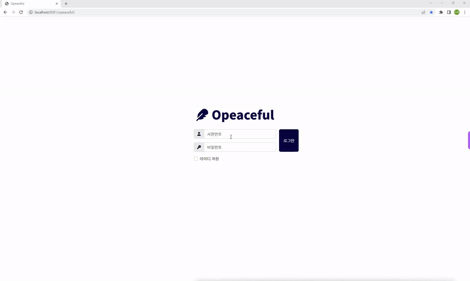
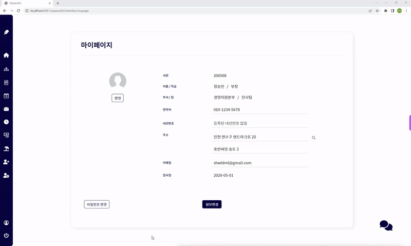
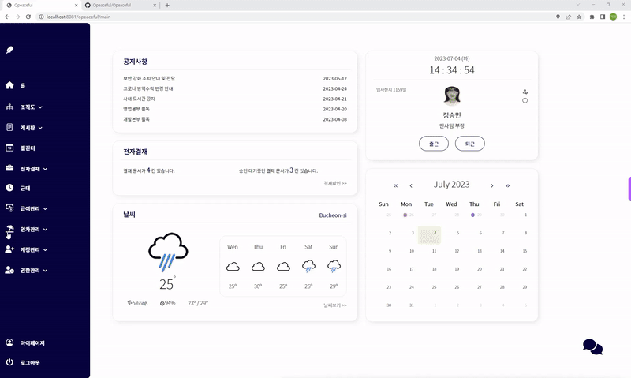

# Opeaceful

> ## 팀원

- [한승은(조장)](#한승은)
- [김진기](#김진기)
- [김혜린](#김혜린)
- [노지의](#노지의)
- [박가영](#박가영)
- [윤지영](#윤지영)

---

> ## 프로젝트 소개

### 사내 그룹웨어 프로그램

실시간 협업, 보안과 접근제어, 업무 문서 및 파일공유
사원 친화적인 그룹웨어를 기획

반응형 웹페이지와 AWS를 통한 배포까지를 목표로 함.

<a href="./Opeaceful/src/main/webapp/resources/etc/pdf/opeaceful.pdf" download="Opeaceful.pdf">[PPT] 다운로드</a>
 
[
 

---

<!-- > ## 주요 기능 -->

<blockquote>
<h2>주요기능</h2>

<small>※각 메뉴 클릭시 상세 내용 확인가능</small>

</blockquote>

 로그인 / 메인 
 

 내정보 
 

 연차관리 
 

 조직도 

[]

 게시판 

[]

 캘린더 

[]

 근태관리 

[]

 계정관리 

[]

 권한관리 

[]

 급여관리 

[]

 전자결제 

  
  - 전자결재 양식
[]
- MY 전자결재
  []

- 전자결재 관리
  []

 채팅 

[]

 다크모드 

[]

 

---

> ## 담당 기능

## 노지의  
    <a href="./Opeaceful/src/main/webapp/resources/etc/pdf/노지의_opeaceful.pdf" download="Opeaceful.pdf">[PPT] 다운로드</a>  

---

## 김진기

---

## 박가영

---

## 한승은

---

## 김혜린

---

## 윤지영

어떻게 설정될지 몰라서 비워뒀어요
나중에 채워두겠습니다!

---

> ## 사용 기술 스택

### 협업 툴

- 미리캔버스
- 구글 시트

### 사용 언어

- FE(Front End)

  - 
  - 
  - 
  - 
  - 

- BE(Back-End)

  - Language: , 
  - WAS(Web-Application-Server):  9.0
  - Database
    - 
    - MySQL Workbench 8.0 CE
    - 
  - Developer tool
    - Java: 
    - Server: 
  - Framework

    - 

    - 

- 사용 디자인 패턴: **MVC 패턴**

### 사용한 오픈 API

- OpenWeather API
- geolocation API
- fulcalendar API

---
